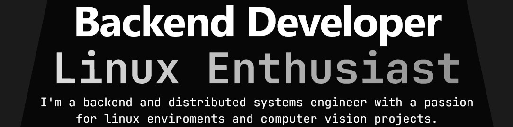

   

--- 

### What I Do

Backend & DevOps Engineer building **scalable, reliable systems**. I design REST APIs, orchestrate deployments with **Docker & Kubernetes**, and set up **CI/CD pipelines** that actually work.

Currently building **SiaERP** at Saisa — a microservices-based ERP platform with 7 business services, event-driven architecture (Redis pub/sub), database-per-service pattern (PostgreSQL), and a custom deployment orchestrator with Proxmox snapshot rollback.

Previously: Designed and built the core ERP system with FastAPI, Docker/Nginx orchestration, GitHub Actions CI/CD, JWT auth with RBAC, and automated PDF generation with MinIO storage.

---

### Tech Stack

  
  
  
  
  
  

  
  
  
  
  
  
  
  
  

  
  
  
  

---

### Featured Projects

<table>
<tr>
<td width="50%">

#### [EcommerceDocker](https://github.com/artumont/EcommerceDocker)
E-commerce API with Docker containerization and Kubernetes load balancing. Includes CI/CD with GitHub Actions, health checks, and a JOURNEY.md documenting the K8s deployment learning process.

**Stack:** Node.js · MongoDB · Docker · Kubernetes · GitHub Actions

</td>
<td width="50%">

#### [GitHotswap](https://github.com/artumont/GitHotswap)
CLI tool to switch between Git user profiles without editing `.gitconfig` manually. Perfect for managing work/personal identities. Features interactive menu and hotswap modes.

**Stack:** Go · Git Integration · CLI

</td>
</tr>
<tr>
<td width="50%">

#### [agent-smith.nvim](https://github.com/artumont/agent-smith.nvim)
Neovim AI agent with bounded visual edits, multi-file changes with approval, semantic search, and sandboxed Vibe sessions. Supports OpenCode, Claude, Cursor, Gemini, Kiro, and Pi providers.

**Stack:** Lua · Neovim · AI Integration

</td>
<td width="50%">

#### [ConcurrentChatSystem](https://github.com/artumont/ConcurrentChatSystem)
Real-time chat system with concurrent rooms using Phoenix WebSockets and Next.js frontend. Built to practice Elixir's actor model and real-time capabilities.

**Stack:** Elixir · Phoenix · Next.js · WebSockets

</td>
</tr>
<tr>
<td width="50%">

#### [DotSlashStream](https://github.com/artumont/dotslashstream)
Torrent-based media streaming platform with support for multiple indexer sites. Monorepo architecture with API service, Redis queues, MinIO storage, and Postgres.

**Stack:** Go · Redis · PostgreSQL · MinIO

</td>
<td width="50%">

#### [remote-wol-esp32](https://github.com/artumont/remote-wol-esp32)
Low-power remote Wake-on-LAN system using ESP32-C6. Runs on USB residual power. Includes Tauri mobile controller with publish-verify cycle via ntfy.sh broker.

**Stack:** C · ESP-IDF · Rust · Tauri · React

</td>
</tr>
</table>

  

---

<h4 align="center">
  <a href="https://artumont.online">artumont.online</a> · 
  <a href="https://www.linkedin.com/in/artumont/">LinkedIn</a> · 
  <a href="mailto:artumontg@gmail.com">Email</a>
</h4>

  <i>"Follow the white rabbit."</i>

