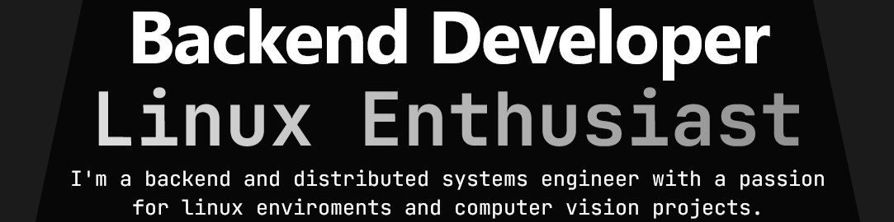

   

--- 

### What I Do

Backend & DevOps Engineer building **scalable, reliable systems**. I design REST APIs, orchestrate deployments with **Docker & Kubernetes**, and set up **CI/CD pipelines** that actually work.

Currently building **SiaERP** at Saisa — a microservices-based ERP platform with 7 business services, event-driven architecture (Redis pub/sub), database-per-service pattern (PostgreSQL), and a custom deployment orchestrator with Proxmox snapshot rollback.

Previously: Designed and built the core ERP system with FastAPI, Docker/Nginx orchestration, GitHub Actions CI/CD, JWT auth with RBAC, and automated PDF generation with MinIO storage.

---

### Tech Stack

  
  
  
  
  
  
  
  

  
  
  
  
  
  
  
  
  

---

<h4 align="center">
  <a href="https://artumont.online">artumont.online</a> · 
  <a href="https://www.linkedin.com/in/artumont/">LinkedIn</a> · 
  <a href="mailto:artumontg@gmail.com">Email</a>
</h4>

  <i>"Follow the white rabbit."</i>

